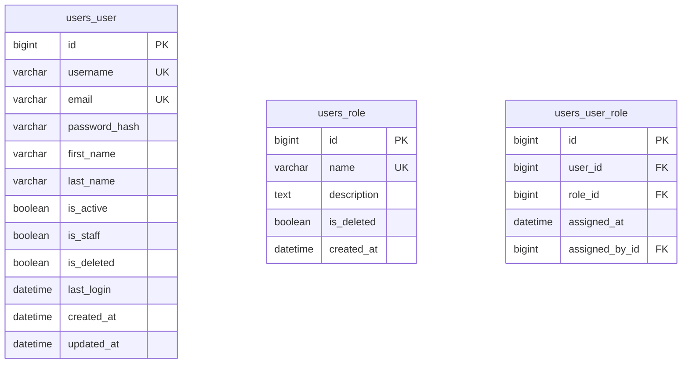
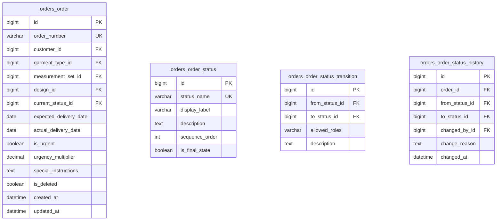
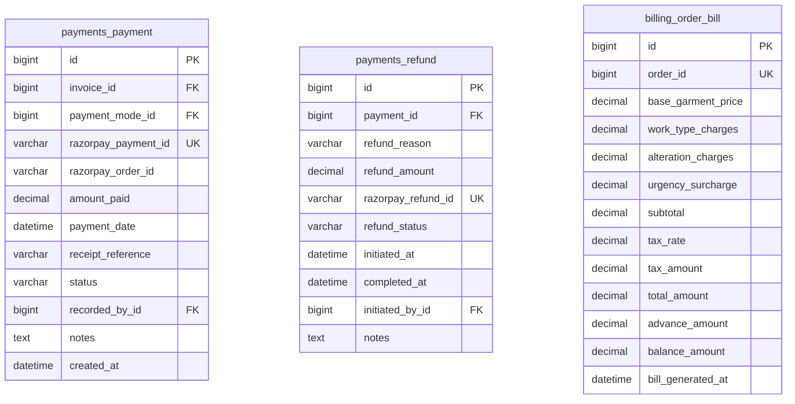
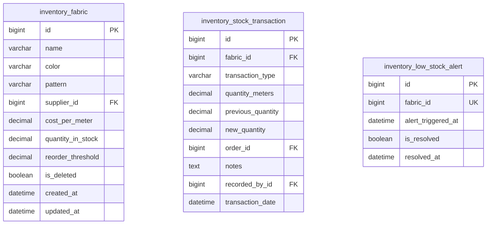

# Database Design

This document provides a comprehensive overview of the Tailoring Management System's database architecture, including ER diagrams, table schemas, and relationships.

## Design Philosophy

1. **BCNF Compliance**: Every determinant is a candidate key
2. **Soft Deletes**: Never hard delete; use `is_deleted` flag
3. **Audit Logging**: All critical changes tracked
4. **Immutability**: Financial records never modified after creation
5. **Transaction Safety**: Foreign key constraints + InnoDB engine
6. **State Machines**: Explicit order lifecycle tracking

## Entity Relationship Diagram

```mermaid
erDiagram
    %% User and Authentication
    USER ||--o{ USER_ROLE : has
    USER_ROLE }o--|| ROLE : references
    ROLE ||--o{ ROLE_PERMISSION : has
    ROLE_PERMISSION }o--|| PERMISSION : references
    USER ||--o| CUSTOMER_PROFILE : has
    
    %% Catalog
    GARMENT_TYPE ||--o{ GARMENT_WORK_TYPE : offers
    GARMENT_WORK_TYPE }o--|| WORK_TYPE : references
    GARMENT_TYPE ||--o{ PRODUCT_IMAGE : displays
    GARMENT_TYPE ||--o{ MEASUREMENT_TEMPLATE : requires
    
    %% Inventory
    FABRIC ||--o{ STOCK_TRANSACTION : tracks
    FABRIC ||--o| LOW_STOCK_ALERT : triggers
    
    %% Measurements
    CUSTOMER_PROFILE ||--o{ MEASUREMENT_SET : has
    MEASUREMENT_SET }o--|| GARMENT_TYPE : for
    MEASUREMENT_SET ||--o{ MEASUREMENT_VALUE : contains
    MEASUREMENT_VALUE }o--|| MEASUREMENT_TEMPLATE : uses
    
    %% Designs
    DESIGN ||--o{ CUSTOMIZATION_NOTE : has
    
    %% Orders Central Entity
    ORDER }o--|| CUSTOMER_PROFILE : placed_by
    ORDER }o--|| GARMENT_TYPE : for
    ORDER }o--o| MEASUREMENT_SET : uses
    ORDER }o--o| DESIGN : includes
    ORDER }o--|| ORDER_STATUS : has_current
    ORDER ||--o{ ORDER_STATUS_HISTORY : tracks
    ORDER ||--o{ ORDER_WORK_TYPE : includes
    ORDER ||--o{ ORDER_ASSIGNMENT : assigned_to
    ORDER ||--o{ ORDER_MATERIAL_ALLOCATION : uses
    ORDER ||--o| TRIAL : schedules
    ORDER ||--o| ORDER_BILL : generates
    ORDER ||--o| DELIVERY : scheduled_for
    ORDER ||--o| FEEDBACK : receives
    
    %% Order Status Transitions
    ORDER_STATUS ||--o{ ORDER_STATUS_TRANSITION : allows
    
    %% Trials and Alterations
    TRIAL ||--o{ ALTERATION : requires
    ORDER ||--o| REVISED_DELIVERY_DATE : may_have
    
    %% Billing and Payments
    ORDER_BILL ||--|| INVOICE : generates
    INVOICE ||--o{ PAYMENT : receives
    INVOICE ||--o{ RAZORPAY_ORDER : creates
    PAYMENT }o--|| PAYMENT_MODE : uses
    PAYMENT ||--o{ REFUND : may_have
    
    %% Delivery
    DELIVERY }o--|| DELIVERY_ZONE : in
    
    %% Notifications
    NOTIFICATION }o--|| NOTIFICATION_TYPE : of_type
    NOTIFICATION }o--o| ORDER : about
    
    %% Audit
    ACTIVITY_LOG }o--|| USER : performed_by
    PAYMENT_AUDIT_LOG }o--|| PAYMENT : tracks
    
    %% Configuration
    SYSTEM_CONFIGURATION ||--o| USER : updated_by
    PRICING_RULE }o--o| GARMENT_TYPE : applies_to
    PRICING_RULE }o--o| WORK_TYPE : applies_to

    %% Reporting Snapshot Tables
    MONTHLY_REVENUE {}
    PENDING_ORDERS_SNAPSHOT {}
    STAFF_WORKLOAD }o--|| USER : for
    INVENTORY_CONSUMPTION }o--|| FABRIC : for
```



## Table Summary

| Module | Tables | Description |
|--------|--------|-------------|
| **Users & Auth** | 5 | User, Role, Permission, UserRole, RolePermission |
| **Customers** | 1 | CustomerProfile |
| **Catalog** | 4 | GarmentType, WorkType, GarmentWorkType, ProductImage |
| **Inventory** | 3 | Fabric, StockTransaction, LowStockAlert |
| **Measurements** | 3 | MeasurementTemplate, MeasurementSet, MeasurementValue |
| **Designs** | 2 | Design, CustomizationNote |
| **Orders** | 7 | Order, OrderStatus, OrderStatusTransition, OrderStatusHistory, OrderWorkType, OrderAssignment, OrderMaterialAllocation |
| **Trials** | 3 | Trial, Alteration, RevisedDeliveryDate |
| **Billing** | 2 | OrderBill, Invoice |
| **Payments** | 6 | PaymentMode, RazorpayOrder, Payment, Refund, PaymentReconciliationLog, WebhookEvent |
| **Delivery** | 2 | DeliveryZone, Delivery |
| **Notifications** | 3 | NotificationType, NotificationChannel, Notification |
| **Feedback** | 1 | Feedback |
| **Reporting** | 4 | MonthlyRevenue, PendingOrdersSnapshot, StaffWorkload, InventoryConsumption |
| **Audit** | 2 | ActivityLog, PaymentAuditLog |
| **Config** | 2 | SystemConfiguration, PricingRule |

**Total: 49 Tables**

## Core Table Schemas

### Users Module



### Orders Module (State Machine)



### Payments Module



### Inventory Module



## Key Relationships

### Order State Machine

The order follows a strict state machine pattern:

```
Booked → Fabric Allocated → Stitching → Trial Scheduled 
       ↓
    Alteration (if needed) → Ready → Delivered → Closed
       ↓
    Cancelled
```

Transitions are enforced by:
1. `orders_order_status` - Defines available states
2. `orders_order_status_transition` - Defines allowed transitions
3. `OrderService.transition_status()` - Validates transitions in code

### Billing Flow

```
Order → OrderBill → Invoice → Payment(s)
                           ↘
                            Refund(s)
```

- `OrderBill` contains calculated amounts
- `Invoice` is immutable once issued
- Multiple `Payment` records can exist per invoice
- `Refund` creates reverse entries

### Inventory Flow

```
Purchase → Fabric (IN) → StockTransaction
                      ↓
Order → Allocation (OUT) → StockTransaction
                        ↓
                  LowStockAlert (if below threshold)
```

## Indexes

Key indexes for query performance:

- `idx_order_status` - Order filtering by status
- `idx_expected_delivery` - Overdue order queries
- `idx_customer_id` - Customer order history
- `idx_fabric_quantity` - Low stock queries
- `idx_payment_date` - Financial reports
- `idx_created_at` - Timeline queries

## Migrations

All schema changes are managed by Django migrations:

```bash
# Create migration
python manage.py makemigrations

# Apply migrations
python manage.py migrate

# Show migration status
python manage.py showmigrations
```

## Backup Recommendations

1. **Daily**: Full database backup
2. **Hourly**: Transaction log backup
3. **Before Deployment**: Pre-migration backup
4. **Retention**: 30 days minimum
