# Sequence Diagrams

This document contains sequence diagrams for all major workflows in the Tailoring Management System.

## Order Lifecycle

### 1. Order Creation Sequence

### 2. Order Status Transition Sequence

### 3. Complete Order Lifecycle

---

## Payment Workflows

### 4. Cash Payment Sequence

### 5. Razorpay Online Payment Sequence

### 6. Razorpay Webhook Sequence

---

## Inventory Workflows

### 7. Stock In Sequence

### 8. Stock Out (Material Allocation) Sequence

---

## Authentication Workflows

### 9. User Login Sequence

### 10. Password Reset Sequence

---

## Billing Workflows

### 11. Bill Generation Sequence

### 12. Invoice PDF Generation Sequence

---

## Notification Workflows

### 13. Email Notification Sequence

---

## Trial & Alteration Workflows

### 14. Trial Scheduling Sequence

```mermaid
sequenceDiagram
    autonumber
    actor Staff
    participant TrialView
    participant Trial
    participant NotificationService
    participant Customer
    
    Staff->>TrialView: Schedule trial for order
    Staff->>TrialView: Enter date, time, location
    
    TrialView->>Trial: Create trial record
    Note over Trial: status = SCHEDULED
    
    TrialView->>NotificationService: Send trial notification
    NotificationService->>Customer: Email: Trial scheduled
    
    TrialView->>Staff: Trial scheduled
    
    Note over Staff,Customer: Customer attends trial
    
    Staff->>TrialView: Update trial status
    
    alt Fits perfectly
        Staff->>Trial: status = COMPLETED
        Staff->>TrialView: Mark order ready
    else Needs alterations
        Staff->>TrialView: Record alterations needed
        TrialView->>TrialView: Create Alteration records
        Staff->>TrialView: Update revised delivery date
    end
```

