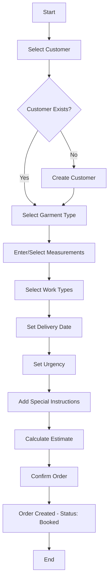
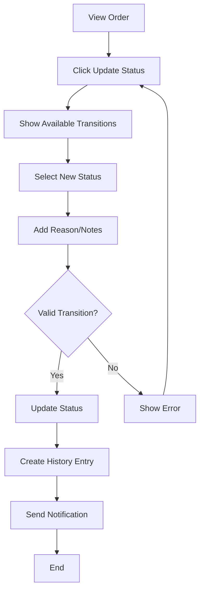
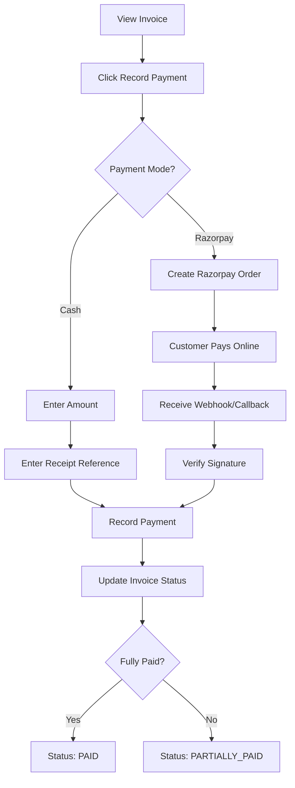
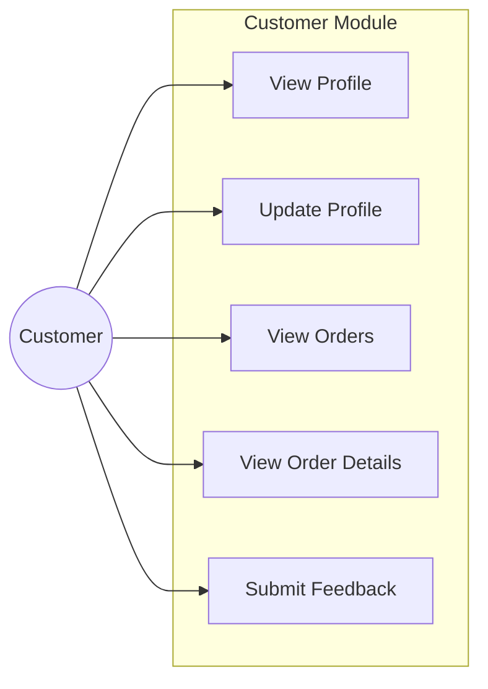
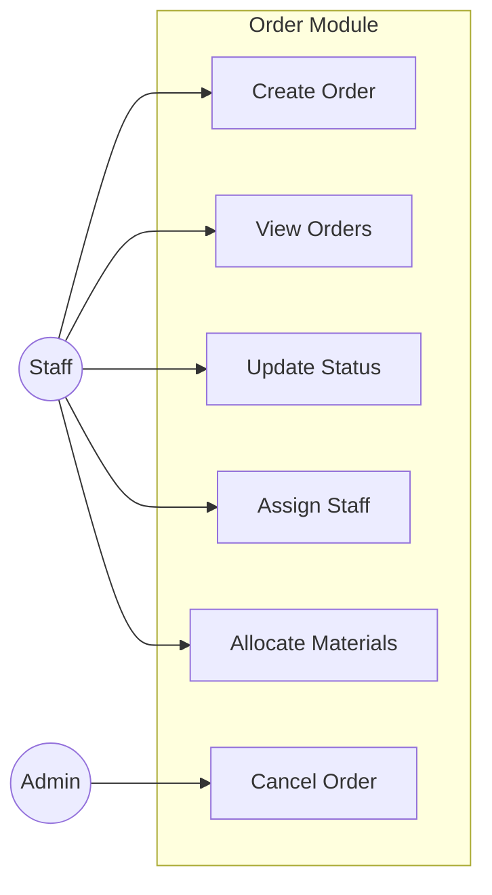
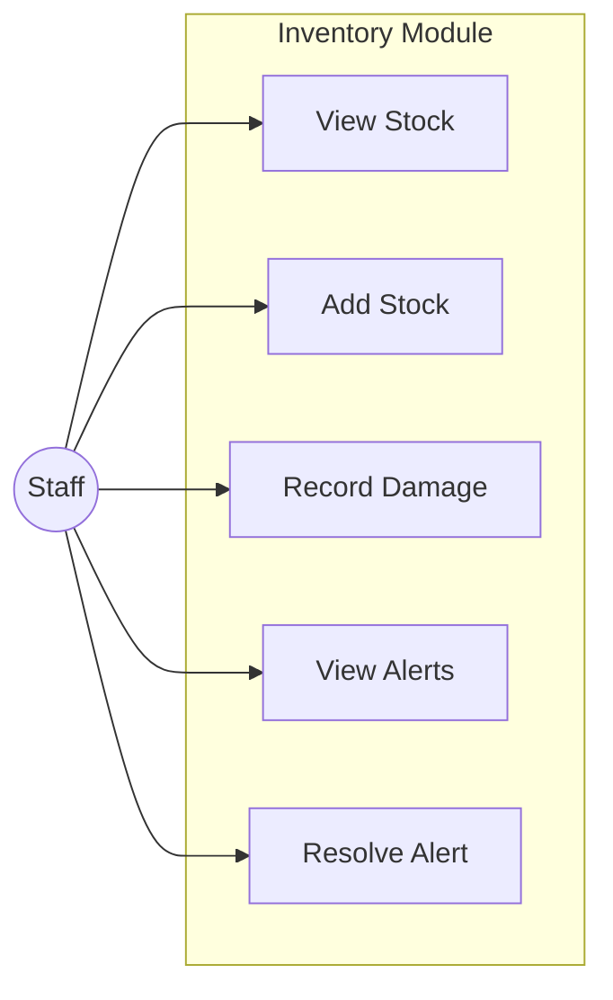
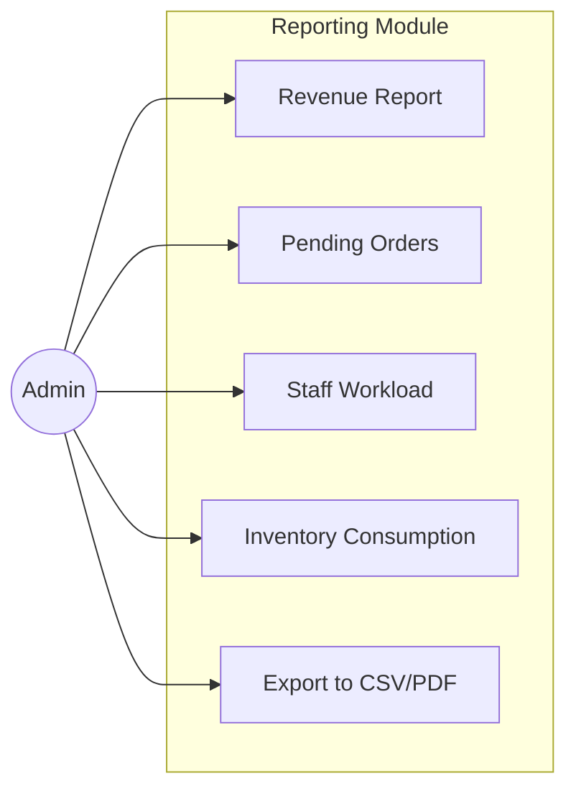

# Use Cases

This document describes the primary use cases for the Tailoring Management System, organized by actor.

## Actors

| Actor | Description |
|-------|-------------|
| **Customer** | End user who places orders and tracks their status |
| **Staff** | General shop employee with order and customer management |
| **Tailor** | Specialist worker who performs stitching and alterations |
| **Designer** | Creates and manages design templates and customizations |
| **Delivery Person** | Handles order delivery and confirmation |
| **Admin** | Full system access including configuration and reports |

## Actor Use Case Diagram

```mermaid
flowchart TB
    subgraph Actors
        Customer((Customer))
        Staff((Staff))
        Tailor((Tailor))
        Designer((Designer))
        Delivery((Delivery))
        Admin((Admin))
    end
    
    subgraph "Customer Portal"
        UC1[View Order Status]
        UC2[View Order History]
        UC3[Submit Feedback]
        UC4[Update Profile]
    end
    
    subgraph "Order Management"
        UC5[Create Order]
        UC6[Update Order Status]
        UC7[Assign Staff]
        UC8[Allocate Materials]
        UC9[Schedule Trial]
        UC10[Record Alteration]
    end
    
    subgraph "Inventory Management"
        UC11[Add Fabric Stock]
        UC12[Record Stock Out]
        UC13[View Low Stock Alerts]
        UC14[Resolve Alert]
    end
    
    subgraph "Billing & Payments"
        UC15[Generate Bill]
        UC16[Create Invoice]
        UC17[Record Payment]
        UC18[Process Refund]
    end
    
    subgraph "Delivery Management"
        UC19[Schedule Delivery]
        UC20[Confirm Delivery]
    end
    
    subgraph "Design Management"
        UC21[Upload Design]
        UC22[Approve Design]
        UC23[Add Customization Notes]
    end
    
    subgraph "Administration"
        UC24[Manage Users]
        UC25[Configure System]
        UC26[View Audit Logs]
        UC27[Generate Reports]
        UC28[Manage Catalog]
    end
    
    Customer --> UC1
    Customer --> UC2
    Customer --> UC3
    Customer --> UC4
    
    Staff --> UC5
    Staff --> UC6
    Staff --> UC7
    Staff --> UC8
    Staff --> UC9
    Staff --> UC15
    Staff --> UC16
    Staff --> UC17
    Staff --> UC19
    
    Tailor --> UC10
    Tailor --> UC6
    
    Designer --> UC21
    Designer --> UC22
    Designer --> UC23
    
    Delivery --> UC20
    
    Admin --> UC18
    Admin --> UC24
    Admin --> UC25
    Admin --> UC26
    Admin --> UC27
    Admin --> UC28
    Admin --> UC11
    Admin --> UC12
    Admin --> UC13
    Admin --> UC14
```

## Detailed Use Cases

### UC1: View Order Status

| Field | Description |
|-------|-------------|
| **Actor** | Customer |
| **Precondition** | Customer is logged in |
| **Main Flow** | 1. Customer navigates to dashboard 2. System displays list of orders 3. Customer clicks on order 4. System shows current status and timeline |
| **Postcondition** | Customer views order details |

---

### UC5: Create Order

| Field | Description |
|-------|-------------|
| **Actor** | Staff, Admin |
| **Precondition** | User is logged in with appropriate role |
| **Main Flow** | 1. Staff clicks "New Order" 2. Selects customer (or creates new) 3. Selects garment type 4. Adds measurements 5. Selects work types 6. Sets delivery date 7. System calculates estimate 8. Staff confirms order |
| **Postcondition** | Order created with status "Booked" |
| **Alternative Flow** | 3a. Customer doesn't exist - Create new customer profile |

---

### UC6: Update Order Status

| Field | Description |
|-------|-------------|
| **Actor** | Staff, Tailor, Admin |
| **Precondition** | Order exists, User has permission |
| **Main Flow** | 1. User views order 2. Clicks "Update Status" 3. Selects new status from allowed transitions 4. Adds reason/notes 5. System validates transition 6. System updates status and logs history |
| **Postcondition** | Order status updated, history recorded |
| **Alternative Flow** | 5a. Invalid transition - Error message shown |

---

### UC11: Add Fabric Stock

| Field | Description |
|-------|-------------|
| **Actor** | Staff, Admin |
| **Precondition** | User is logged in |
| **Main Flow** | 1. Navigate to Inventory 2. Click "Add Stock" 3. Select fabric (or create new) 4. Enter quantity received 5. Enter unit cost 6. Add notes 7. System creates transaction 8. System updates stock level |
| **Postcondition** | Stock increased, transaction recorded |

---

### UC15: Generate Bill

| Field | Description |
|-------|-------------|
| **Actor** | Staff, Admin |
| **Precondition** | Order exists |
| **Main Flow** | 1. View order 2. Click "Generate Bill" 3. System calculates:    - Base garment price    - Work type charges    - Alteration charges    - Urgency surcharge    - Tax 4. System creates OrderBill 5. Staff enters advance amount 6. System calculates balance |
| **Postcondition** | Bill created with computed totals |

---

### UC17: Record Payment

| Field | Description |
|-------|-------------|
| **Actor** | Staff, Admin |
| **Precondition** | Invoice exists |
| **Main Flow** | 1. View invoice 2. Click "Record Payment" 3. Select payment mode (Cash/Razorpay) 4. For Razorpay:    - Create Razorpay order    - Customer completes payment    - Verify signature 5. For Cash:    - Enter amount    - Enter receipt reference 6. System records payment 7. System updates invoice status |
| **Postcondition** | Payment recorded, invoice status updated |

---

### UC21: Upload Design

| Field | Description |
|-------|-------------|
| **Actor** | Designer, Staff |
| **Precondition** | User has designer/staff role |
| **Main Flow** | 1. Navigate to Designs 2. Click "Upload Design" 3. Select file (PDF/JPG/PNG) 4. Enter name and description 5. Optionally link to order 6. System validates file 7. System saves design |
| **Postcondition** | Design uploaded, pending approval |
| **Alternative Flow** | 6a. Invalid file type - Error shown |

---

### UC24: Manage Users

| Field | Description |
|-------|-------------|
| **Actor** | Admin |
| **Precondition** | User is admin |
| **Main Flow** | 1. Navigate to User Management 2. View user list 3. Click user to edit 4. Modify roles/permissions 5. Save changes |
| **Postcondition** | User updated |

---

## Use Case by Module

### Customer Module

### Order Module

### Inventory Module

### Reporting Module

